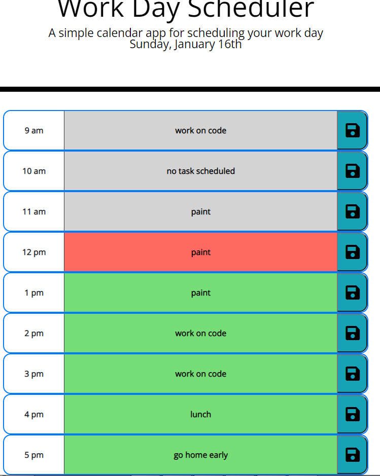

# Calendar - Work Day Scheduler

## Description

Use this to schedule your workday
- Color coding tells you when tasks are due
- Save your task by clicking the save button next to it
- updates every hour!

## Website

You can access the deployed website here:
 
https://moses-ian.github.io/calendar

### Screenshots

## Credits

- Starter code from UofA Bootcamp
- [moment.js](https://momentjs.com/)
- [Bootstrap](https://getbootstrap.com)
- [jQuery](https://jquery.com/)
- [Font Awesome](https://fontawesome.com/)

## License

Please do not copy any of my code.

## Contributions

Made by Ian Moses